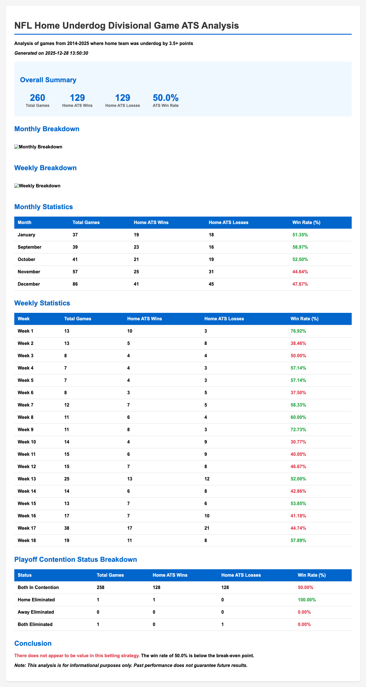
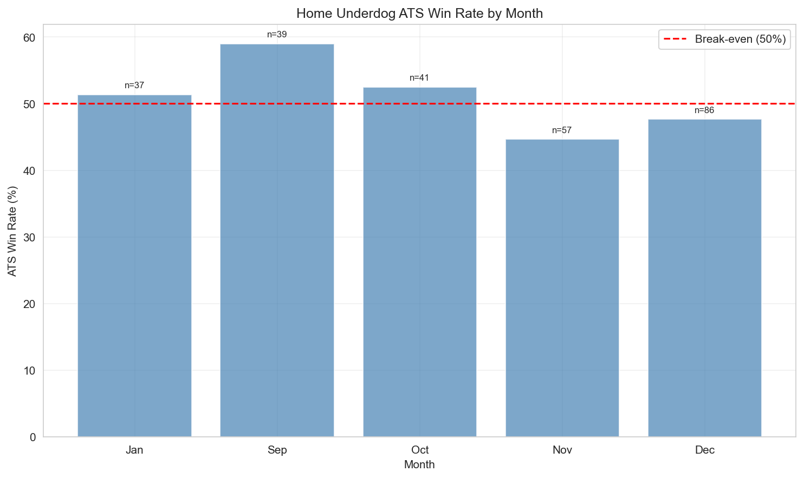
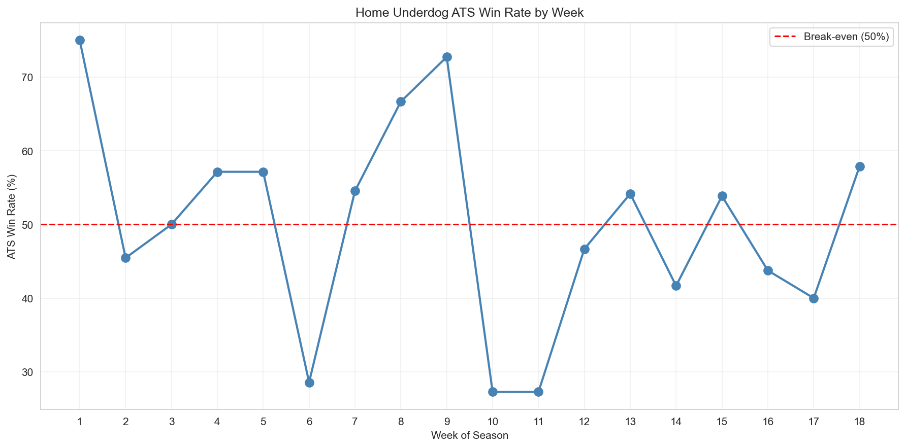

> **Decade-long strategy backtest** that quantifies edge with automated reporting — the same method used to evaluate a strategy's profitability before committing budget.

# NFL Home Underdog Divisional Game ATS Analysis

## Live report

[](https://stephencox1026.github.io/nfl-home-underdog-ats/outputs/analysis_report.html)

**[Open the live analysis report](https://stephencox1026.github.io/nfl-home-underdog-ats/outputs/analysis_report.html)**

## Sample outputs




This project analyzes NFL divisional games from 2014-2024 where the home team was an underdog by 3.5+ points to determine if there is betting value in consistently betting on these teams against the spread (ATS).

## Features

- Identifies all qualifying games (home underdog by 3.5+ in divisional matchups)
- Tracks ATS performance for home teams
- Breaks down results by month and week of season
- Determines playoff elimination status for both teams at time of game
- Includes weather conditions, starting QBs, and head coaches (where available)
- Generates comprehensive CSV and HTML reports with visualizations

## Requirements

- Python 3.8+
- See `requirements.txt` for Python dependencies

## Installation

1. Clone or download this repository

2. Install dependencies:
```bash
pip install -r requirements.txt
```

## Data Sources

The analysis uses data from:

- **Spreadspoke.com**: Historical NFL game data including scores, spreads, and weather conditions (1966-present)
  - Data is downloaded automatically from their CSV file
  - If automatic download fails, you can manually download from: https://www.spreadspoke.com/data.html

- **Note on QB and Coach Data**: The current implementation includes placeholder functions for fetching quarterback and coach data. These will need to be implemented using:
  - Pro-Football-Reference.com scraping
  - NFL API (if available)
  - Manual data entry for specific games
  - Other sports data APIs

## Usage

Run the main analysis script:

```bash
python main.py
```

The script will:
1. Download/load NFL game data
2. Calculate playoff elimination status
3. Filter and analyze qualifying games
4. Generate reports in the `outputs/` directory

## Output Files

After running the analysis, the following files will be generated in the `outputs/` directory:

- `games_list.csv`: Complete list of all qualifying games with full details
- `summary_stats.csv`: Summary statistics broken down by various categories
- `analysis_report.html`: Comprehensive HTML report with visualizations
- `monthly_breakdown.png`: Chart showing ATS win rate by month
- `weekly_breakdown.png`: Chart showing ATS win rate by week

## Configuration

Edit `config.py` to adjust:
- `START_SEASON` and `END_SEASON`: Years to analyze
- `SPREAD_THRESHOLD`: Minimum spread for home underdog (default: 3.5)
- `OUTPUT_DIR`: Directory for generated reports

## Project Structure

```
project/
├── main.py                 # Entry point
├── data_collector.py       # NFL data and spread fetching
├── playoff_calculator.py   # Playoff elimination logic
├── analyzer.py            # Game filtering and ATS analysis
├── report_generator.py    # CSV and report generation
├── config.py              # Configuration (seasons, thresholds)
├── utils.py               # Helper functions
├── requirements.txt       # Dependencies
├── README.md             # Documentation
└── outputs/              # Generated reports and CSVs
```

## Analysis Criteria

Games are included in the analysis if they meet ALL of the following criteria:

1. **Divisional Matchup**: Both teams are in the same division
2. **Home Underdog**: Home team is an underdog by 3.5+ points (spread from home perspective)
3. **Complete Data**: Game has scores and spread data available
4. **Time Period**: Game occurred between 2014-2024 seasons

## ATS Calculation

ATS (Against The Spread) results are calculated from the home team's perspective:
- **Cover**: Home team covers the spread (loses by less than spread or wins)
- **Loss**: Home team fails to cover the spread
- **Push**: Home team result exactly matches the spread

## Limitations

1. **QB and Coach Data**: Currently placeholder - needs implementation
2. **Playoff Elimination**: Uses simplified heuristics - full implementation would require complete standings calculations
3. **Data Accuracy**: Depends on accuracy of Spreadspoke.com data
4. **Weather Data**: Relies on data from Spreadspoke; fallback weather APIs not yet implemented

## Future Enhancements

- Implement QB and coach data fetching
- Improve playoff elimination calculations with full standings
- Add weather API fallback options
- Add more detailed statistical analysis
- Include betting odds/returns calculations
- Add database storage option

## Disclaimer

This analysis is for informational and educational purposes only. Past performance does not guarantee future results. Sports betting involves risk, and you should only bet what you can afford to lose.

## License

This project is provided as-is for educational purposes.

